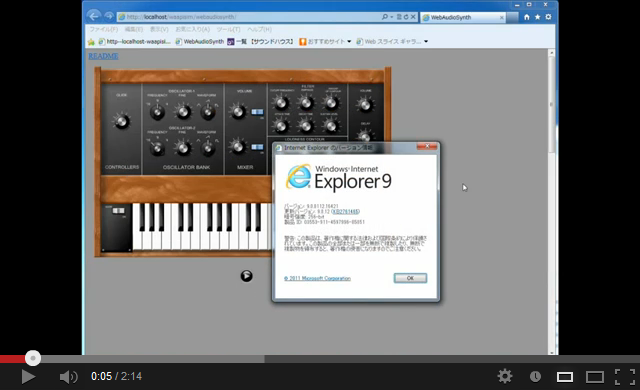

# WAAPISim : Web Audio API Simulator

WAAPISim is a 'WebAudioAPI' polyfill fallbacking to the 'Audio Data API', or Flash.  
In addition, even in WebAudio API ready browsers, add some latest method name for node-creation and start/stop if the browser does not support these method name. 

WAAPISim automatically check the availability of APIs:  
WebAudioAPI => AudioDataAPI => Flash

* Chrome : WebAudioAPI is supported. WAAPISim do nothing.
* Safari (include iOS) : WebAudioAPI is supported but old method name is used. WAAPISim add new method name for node-creation, start/stop and setTargetAtTime.
* Firefox : Simulate using AudioDataAPI
* Opera : Simulate using Flash
* MSIE : Simulate using Flash. Float32Array is assigned to normal Array(IE9).

For more detail:
**<http://www.g200kg.com/docs/waapisim/>**

**WebAudioSynth running on MSIE**
  

## Some Links of Test-pages

Try these pages with Firefox/Opera or MSIE.

[Node test (Oscillator/ScriptProcessor/BiquadFilter/WaveShaper/Panner/Analyser)](http://www.g200kg.com/docs/waapisim/nodetest.html)  
[Compressor test](http://www.g200kg.com/docs/waapisim/comptest.html)  
[AudioParam Automation test](http://www.g200kg.com/docs/waapisim/automationtest.html)  
[ChannelSplitter/ChannelMerger test](http://www.g200kg.com/docs/waapisim/test-split.html)  
[Oscillator custom waveform test](http://www.g200kg.com/docs/waapisim/samples/test-osccustom.html)  

**Shiny Happy MIDI Drum Machine (MIDIDrums)** (by Chris Wilson + (Chris Rogers and Ken Moore)) with WAAPISim  
**<http://g200kg.github.com/MIDIDrums/>** forked from <https://github.com/cwilso/MIDIDrums>  

**WebAudioSynth** (by aike) with WAAPISim  
**<http://g200kg.github.com/webaudiosynth/>** forked from <https://github.com/aike/webaudiosynth>  

## Current Status

* **Support** : OscillatorNode / ChannelSplitterNode / ChannelMergerNode / AudioBufferSourceNode / WaveShaperNode / AnalyserNode / GainNode / BiquadFilterNode / DelayNode / DynamicsCompressorNode / PannerNode / ScriptProcessorNode / ConvolverNode

* **Not Support** : MediaElementAudioSourceNode / MediaStreamAudioSourceNode / MediaStreamAudioDestinationNode / OfflineAudioCOntext

* ConvolverNode : By performance reason, convolution is executed for only IR's first 1000 samples. Sebsequent part will be replaced as simple delays.

* PannerNode : Simplified. Listener position should stay default. Source positions are interpreted as x-z 2d coordinate.

* ScriptProcessorNode : Input buffer size should be 1024 and under (No limitation if use output only)

* DynamicsCompressorNode : A little different characteristics from Chrome's implements.

* Number of channels in each nodes should be 1 (mono) or 2(stereo)

* createBuffer from ArrayBuffer and decodeAudioData supports only wav format.

* k-rate AudioParam controls are executed only per 1024 samples frequency. a-rate AudioParams are controlled by sample.

## Usage

Load the 'waapisim.js' before using the Web Audio API functions in your script.

``

To enable fallbacking to Flash, place the 'waapisim.swf' file to same folder as 'waapisim.js'.  

### Options

These lines should be specified before loading the 'waapisim.js'

``  
Enable internal log info to console.

``  
Enable WAAPISim even if native WebAudioAPI is available.

``  
Disable WAAPISim if native WebAudioAPI is available even lacking oscillator function (means Firefox 23). This flag is default on (=1).

## License
Copyright (c) 2013 g200kg  
<http://www.g200kg.com/>  
Released under the MIT License
